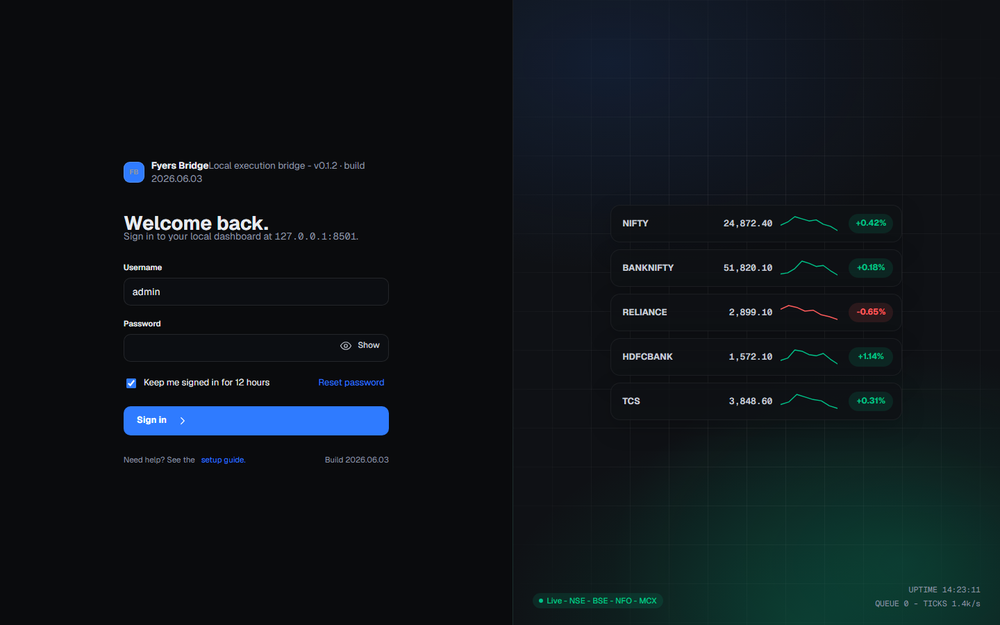
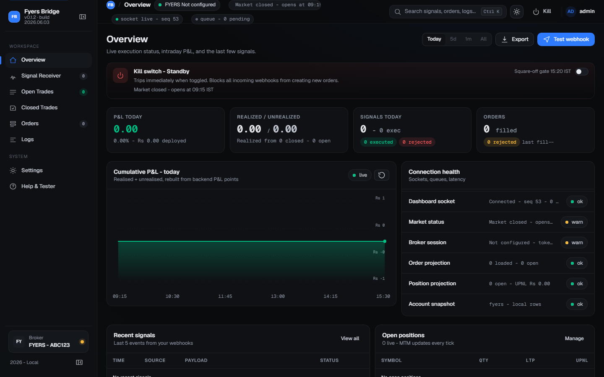
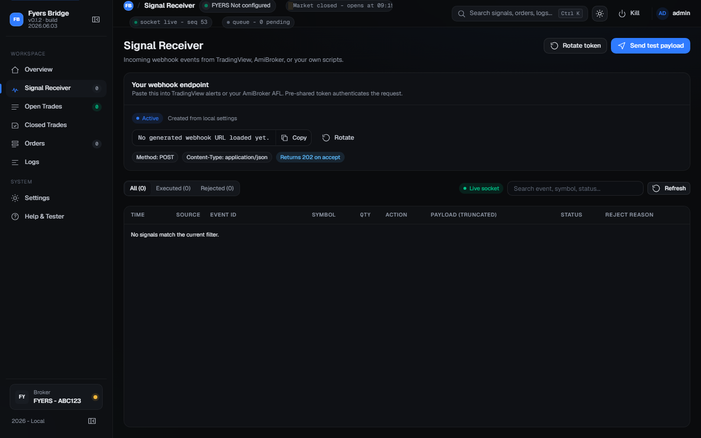
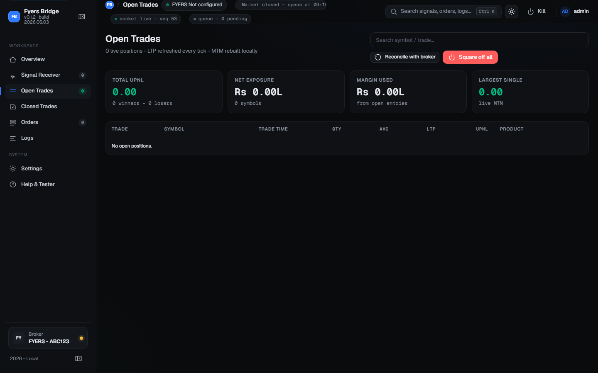
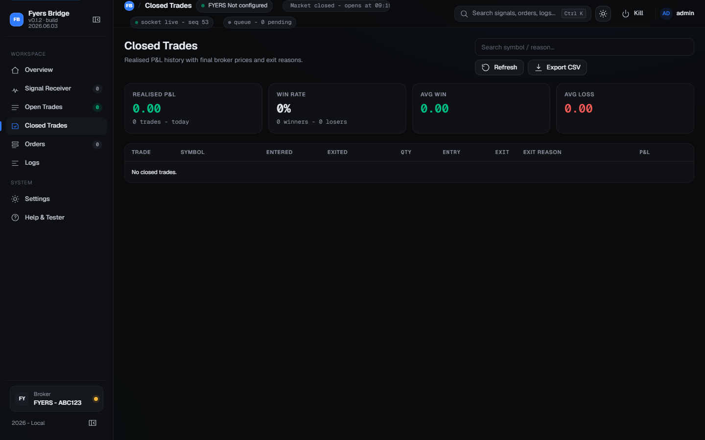
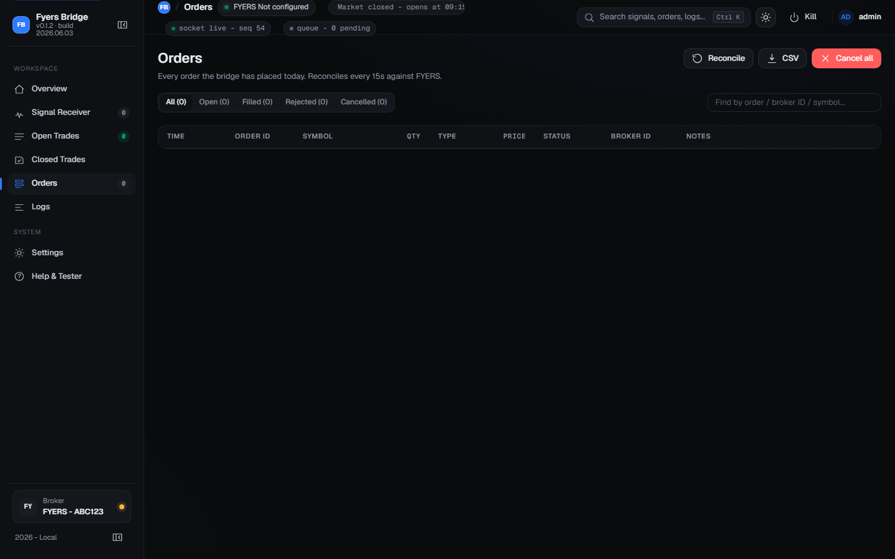
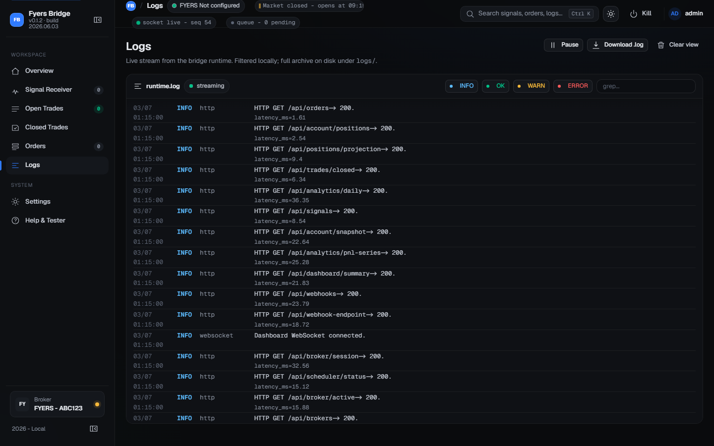
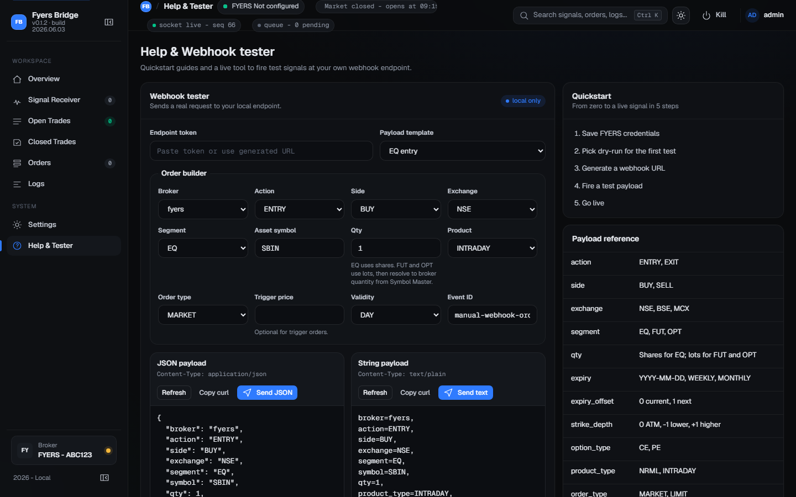
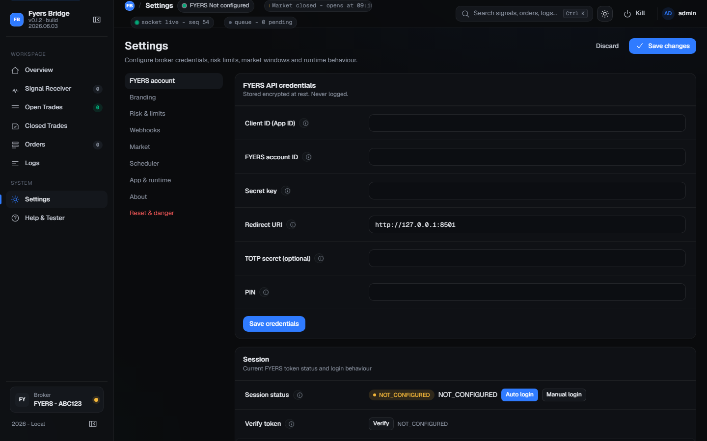

# Trading Bridge User Guide

Version 0.1.2 | Build 2026.06.03

Source PDF: /assets/guide/fyers-bridge-user-guide.pdf

## 1. What is Trading Bridge?

Trading Bridge is a local program that runs on your Windows computer and connects your trading signals to your Fyers broker account automatically. You run it once, and it sits in the background routing every alert from TradingView (or any other tool) directly to Fyers as a live order.

You do not need any coding knowledge to use it. Everything is controlled from a web dashboard you open in your browser.

> **Tip:** All your data — credentials, trades, logs — stays only on your computer. Nothing is sent to any external server.

### How it works in simple terms

1. Your trading tool (TradingView, AmiBroker, etc.) sends an alert to a special URL called a Webhook.
2. Trading Bridge receives the alert, validates it, and resolves the exact Fyers symbol.
3. It places the order on your Fyers account automatically.
4. The dashboard updates in real time to show you the result — signal received, order placed, position open, P&L.

## 2. Starting and Restarting the App

### Starting Trading Bridge for the first time

1. Locate the file trading-bridge.exe on your computer.
2. Double-click trading-bridge.exe to start it. A black terminal window will appear — this is normal. Do not close it.
3. Open your browser (Chrome or Edge recommended) and go to the address: http://127.0.0.1:8501
4. The Trading Bridge login screen will appear.



> **Important:** The terminal window must stay open. If you close it, the app stops and no signals will be processed.

### Restarting the app

- If the app stopped (e.g. computer restarted): double-click trading-bridge.exe again, then refresh your browser.
- If the app is slow or unresponsive: close the terminal window, wait 5 seconds, then double-click the exe again.
- If you changed the port or host settings inside the app, you will need to restart the exe for them to take effect.

> **Note:** Restart does not delete any data. Your credentials, webhooks, and trade history are all stored separately and are safe.

### What the status bar tells you

At the top of every page in the dashboard you will see a status bar with coloured dots. These tell you what the app is doing at a glance:

| Indicator | What it means |
| --- | --- |
| FYERS Not configured | You have not entered your Fyers API credentials yet. Go to Settings first. |
| Market closed - opens at 09:15 | NSE is not currently open. Signals received now will be rejected until market opens. |
| socket live - seq N | The live dashboard connection is working correctly. |
| queue - 0 pending | No signals are waiting to be processed. |

## 3. Logging In to the Dashboard

The dashboard has its own login screen to keep it secure from other people on your network. This is separate from your Fyers account.

| Field | What to enter |
| --- | --- |
| Username | Your dashboard username (usually admin for first setup). |
| Password | Your dashboard password set during first-time configuration. |
| Keep me signed in for 12 hours | Tick this so you do not need to log in again each time you open the browser. |

Click the blue Sign in button to proceed to the Overview screen.

## 4. First-Time Setup: Connecting to Fyers

Before any live orders can be placed, you must enter your Fyers API credentials. This is a one-time setup. Click Settings in the left sidebar.


### Step 1: Enter your Fyers API credentials

Go to Settings > FYERS account. Fill in each field:

| Field | Where to find it | Notes |
| --- | --- | --- |
| Client ID (App ID) | myapi.fyers.in > My Apps | Looks like XXXXXXXX-100 |
| FYERS account ID | Your Fyers login ID | Example: XY12345 |
| Secret key | myapi.fyers.in > My Apps | Copy it once — it is shown only once |
| Redirect URI | myapi.fyers.in > My Apps | Must match exactly. Usually http://127.0.0.1:8501 |
| TOTP secret (optional) | Fyers 2FA authenticator setup | Enables fully automated daily login — highly recommended |
| PIN | Your Fyers 4-digit login PIN | Required for automated login via TOTP |

Click Save credentials after filling in all fields. The secret key is encrypted automatically — it is never stored in plain text.

### Step 2: Log in to Fyers

After saving credentials, scroll down to the Session section. You will see two buttons:

- Auto login — Recommended if you have filled in TOTP secret and PIN. The app logs in to Fyers automatically without any browser interaction.
- Manual login — Opens the Fyers login page in a new tab. Log in there, then copy the code back into the app.

> **Tip:** Fyers sessions expire each day. You will need to log in again every morning. Setting up TOTP + PIN lets the app do this automatically at 08:00 AM every day.

### Step 3: Verify the session

Click the Verify button to confirm the session is active. The status will change from NOT_CONFIGURED to a green ACTIVE badge.

## 5. Overview Screen

The Overview is the home screen. It shows you everything important at a glance — P&L, connection status, recent signals, and open positions.



| What you see | What it means |
| --- | --- |
| Kill switch - Standby (red toggle) | The emergency stop. When toggled ON it blocks all new orders immediately. Click it once to activate, click again to deactivate. |
| P&L Today | Your total profit and loss for today in Rupees. |
| Realized / Unrealized | Realized = closed trades. Unrealized = open positions still running. |
| Signals Today | How many webhook signals arrived and how many were executed vs rejected. |
| Orders | How many orders were filled today. |
| Cumulative P&L chart | Intraday P&L curve from 09:15 to 15:30. |
| Connection health | Status of broker session, market data feed, and dashboard socket. |
| Recent signals | Last 5 webhook signals received. Click View all to see the full list. |
| Open positions | Summary of live trades. Click Manage to go to Open Trades screen. |

## 6. Signal Receiver

The Signal Receiver screen shows every webhook signal that has arrived at the app. This is the main screen for checking whether your TradingView alerts are being received and processed correctly.



### Your webhook URL

At the top of the Signal Receiver you will see Your webhook endpoint. This is the URL you paste into TradingView (or any other tool) as the alert destination. Copy it using the Copy button.

> **Important:** If you are using TradingView, you need a public URL (ngrok). See Section 9 — Webhook Setup — for how to get one.

### Reading the signal table

| Column | What it shows |
| --- | --- |
| Time | When the signal arrived. |
| Source | Where it came from: TV (TradingView), AB (AmiBroker), WH (generic webhook). |
| Event ID | The unique ID you sent in the signal. |
| Symbol | The trading symbol (e.g. SBIN, NIFTY). |
| Action | BUY ENTRY, SELL EXIT, etc. |
| Status | Green = Executed (order was placed). Red = Rejected (check rejection reason). |
| Reject reason | If rejected, the reason code explains why (e.g. KILL_SWITCH_ACTIVE). |
| Details button | Click to see the full signal pipeline step by step. |

Use the All / Executed / Rejected filter buttons to narrow the list. Use the Search box to find a specific symbol or event ID.

Click Rotate token to generate a new webhook URL if the old one is ever exposed or needs to be changed.

## 7. Open Trades

The Open Trades screen shows all your currently live positions. LTP (Last Traded Price) and unrealised P&L update with every market tick.



| Button / Column | What it does |
| --- | --- |
| Exit button (on each row) | Immediately places a market order to close that one position. |
| Square off all (red button) | Closes ALL open positions at once with market orders. |
| Reconcile with broker | Pulls fresh position data from Fyers if the display looks incorrect or stale. |
| Avg column | Your average entry price for that position. |
| LTP column | The last market price — updates every tick. |
| UPNL column | Unrealised profit/loss in Rupees. Green = profit, Red = loss. |

> **Warning:** Square off all does NOT require confirmation. Clicking it immediately sends exit orders for every open position. Use with care.

## 8. Closed Trades

All completed trades with their entry and exit prices, exit reason, and the final realised P&L.



| What you see | What it means |
| --- | --- |
| Exit reason | Why the position was closed: MANUAL_EXIT (you clicked Exit), SQUARE_OFF (Square off all was used), STOPLOSS, etc. |
| P&L column | Final profit or loss on that trade in Rupees. |
| Export CSV button | Downloads all closed trades as a spreadsheet file (closed-trades.csv). |
| Win rate (top metric) | Percentage of closed trades that were profitable. |
| Avg win / Avg loss | Average profit on winning trades and average loss on losing trades. |

## 9. Orders

Every order that Trading Bridge has placed on your Fyers account today. This is separate from Trades — one trade can have multiple orders (entry order, exit order, etc.).



| Filter / Button | What it does |
| --- | --- |
| All / Open / Filled / Rejected / Cancelled | Filter the order list to see only that status. |
| Reconcile button | Syncs the order list with the latest data from Fyers. |
| Modify button (on open orders) | Change the price or trigger price of a pending order. |
| Cancel button (on open orders) | Cancel one specific pending order. |
| Cancel all (red button) | Cancel every pending order in one action. |
| CSV button | Download today's orders as a file. |

## 10. Logs

The Logs screen shows a live stream of everything the app is doing in the background — webhook received, symbol resolved, order placed, broker response, errors.



| Control | What it does |
| --- | --- |
| Pause / Resume button | Pause freezes the display so you can read a line. Resume goes live again. |
| INFO / OK / WARN / ERROR buttons | Toggle each log level on or off to filter noise. |
| Search (grep) box | Type a symbol name or keyword to show only matching log lines. Example: type SBIN to see only SBIN activity. |
| Download .log button | Save the full log archive to a file on disk. |
| Clear view button | Clears the visible log display (does not delete the log file). |

> **Note:** If something is not working, check the Logs screen first. It will show the exact error — for example, SYMBOL_NOT_FOUND, BROKER_SESSION_EXPIRED, or QUOTE_UNAVAILABLE.

## 11. Webhook Setup (Connecting TradingView)

To receive signals from TradingView, you need a public internet URL. The app can create one automatically using a free tool called ngrok. Go to Settings > Webhooks.

### Setting up ngrok (recommended for TradingView)

1. Create a free account at ngrok.com.
2. Copy your Auth Token from the ngrok dashboard (it is on the main page after you sign in).
3. In Trading Bridge, go to Settings > Webhooks. Find the ngrok token field and paste your token there.
4. Change the URL mode dropdown to ngrok public URL.
5. Click Save changes, then click the Restart ngrok button.
6. The ngrok status changes to running (green) and a public URL like https://abc123.ngrok-free.app/webhook/... appears.
7. Copy that full URL and paste it as the Webhook URL in TradingView.

> **Important:** The public ngrok URL changes every time you restart ngrok unless you have a paid ngrok plan with a reserved domain. If your URL changes, update TradingView alerts too.

### URL mode options

| Mode | When to use it |
| --- | --- |
| Localhost | Only for testing from the same computer. TradingView cannot reach this. |
| Server IP | Another computer on your home or office network needs to send signals. |
| ngrok public URL | TradingView or any internet-based sender. This is the standard choice. |

## 12. What to Send — Signal Format

Your trading tool sends a JSON message to the webhook URL. Here are the most common examples you can copy and use directly in TradingView alert messages:

### Equity (NSE share)

```json
{
  "action": "ENTRY",
  "side": "BUY",
  "exchange": "NSE",
  "segment": "EQ",
  "symbol": "SBIN",
  "qty": 1,
  "product_type": "INTRADAY",
  "order_type": "MARKET",
  "event_id": "my-signal-001"
}
```

### Futures (NIFTY monthly, current expiry)

```json
{
  "action": "ENTRY",
  "side": "BUY",
  "exchange": "NSE",
  "segment": "FUT",
  "symbol": "NIFTY",
  "expiry_mode": "MONTHLY",
  "expiry_offset": 0,
  "qty": 1,
  "product_type": "NRML",
  "order_type": "MARKET",
  "event_id": "fut-001"
}
```

### Options (NIFTY weekly ATM call)

```json
{
  "action": "ENTRY",
  "side": "BUY",
  "exchange": "NSE",
  "segment": "OPT",
  "symbol": "NIFTY",
  "expiry": "WEEKLY",
  "expiry_offset": 0,
  "strike_depth": 0,
  "option_type": "CE",
  "qty": 1,
  "product_type": "NRML",
  "order_type": "MARKET",
  "event_id": "opt-001"
}
```

### Exiting a position

```json
{
  "action": "EXIT",
  "side": "SELL",
  "exchange": "NSE",
  "segment": "EQ",
  "symbol": "SBIN",
  "qty": 1,
  "product_type": "INTRADAY",
  "order_type": "MARKET",
  "event_id": "exit-001"
}
```

### Field reference

| Field | Required? | Values and meaning |
| --- | --- | --- |
| action | Yes | ENTRY to open a position. EXIT to close it. |
| side | Yes | BUY or SELL. |
| exchange | Yes | NSE, BSE, or MCX. |
| segment | Yes | EQ (shares), FUT (futures), or OPT (options). |
| symbol | Yes | The underlying name — SBIN, NIFTY, BANKNIFTY etc. |
| qty | Yes | Shares for EQ. Lots for FUT and OPT (app converts automatically). |
| product_type | Yes | INTRADAY (MIS) or NRML (carry forward). |
| order_type | Yes | MARKET or LIMIT. |
| event_id | Yes | Any unique text string. Prevents duplicate orders. |
| price | Only for LIMIT | The limit price to place the order at. |
| expiry_mode | FUT/OPT only | MONTHLY or WEEKLY. |
| expiry_offset | FUT/OPT only | 0 = current expiry, 1 = next expiry. |
| strike_depth | OPT only | 0 = ATM (at-the-money). -1 = one strike below. +1 = one above. |
| option_type | OPT only | CE (call) or PE (put). |

## 13. Testing a Signal — Help & Tester Screen

Before connecting TradingView, you can test the full signal pipeline from inside the browser using the built-in webhook tester. Click Help & Tester in the sidebar.



### Sending a test signal

1. Click the Payload template dropdown and pick an example that matches what you want to test — EQ entry, FUT monthly, OPT weekly ATM CE, or OPT exact strike PE.
2. Fill in the form fields: Action (ENTRY/EXIT), Side (BUY/SELL), Exchange, Segment, Symbol (e.g. SBIN), Qty, Product, and Order type.
3. For options, extra fields appear — Expiry, Strike depth, Option type.
4. Review the JSON payload preview on the left. You can also edit it directly.
5. Click Send JSON. The status message shows whether the signal was accepted.
6. Check the Signal Receiver screen to see the signal appear and whether it was executed or rejected.

> **Warning:** Always test with Dry-run mode ON first. Dry-run simulates the full pipeline but never sends a real order to Fyers. Turn it off only when you are ready to go live.

## 14. Risk Controls

Risk controls are in Settings > Risk & limits. These are the most important settings before going live.



| Setting | What it does |
| --- | --- |
| Dry-run mode | ON = all signals are simulated. No real order is ever sent to Fyers. Use for testing. Turn OFF only when ready for live trading. |
| Live trading enabled | Must be ON for real orders to be placed. An extra safety switch on top of dry-run. |
| Kill switch | Toggle this ON instantly from the Overview screen to block all new orders. Does not close open positions. |
| Max order qty | Any signal with a quantity above this number is rejected immediately. |
| Max open trades | If you already have this many open positions, new ENTRY signals are rejected. |
| Allowed exchanges | Signals to any exchange not in this list are rejected. Default: NSE, BSE. |
| Allowed products | Signals with a product_type not in this list are rejected. Default: NRML, INTRADAY. |
| Market-hours gate | When ON, ENTRY signals outside your configured trading window are rejected automatically. |

> **Important:** To go live: turn off Dry-run AND turn on Live trading enabled. Both must be set correctly or orders will not reach Fyers.

## 15. Scheduler — Automatic Daily Operations

The scheduler automatically handles daily market tasks so the app is fully ready by 09:15 without any manual steps. Configure it in Settings > Scheduler.

| Time setting | What the app does automatically at that time |
| --- | --- |
| Auto login / token refresh (default 08:00) | Logs in to Fyers using your saved TOTP and PIN. Refreshes the session token for the day. |
| Instrument refresh (default 08:05) | Downloads the latest Symbol Master (instrument data) from Fyers for today. |
| Data socket connect (default 09:00) | Opens the live market data feed for real-time prices. |
| Entry window start (default 09:15) | Signals with action ENTRY are now accepted. |
| Entry window stop (default 15:15) | ENTRY signals are blocked after this time. EXIT signals continue to work. |
| Square-off gate (default 15:20) | Reference time for auto risk-off. Open positions may be auto-closed at this time. |
| Wind down (default 15:35) | Market close sequence begins. |

> **Note:** The scheduler only works if the app (trading-bridge.exe) is already running. Start it before market hours, ideally by 07:55 AM each trading day.

## 16. Symbol Master

The Symbol Master is the app's internal database of every stock, futures contract, and options strike available on Fyers. The app uses it to convert a simple signal like NIFTY weekly ATM CE into the exact Fyers code NSE:NIFTY25JUL25000CE.

It refreshes automatically each morning at 08:05 via the scheduler. You can also refresh it manually:

1. Go to Settings > Market.
2. Click the Refresh Now button next to Symbol Master.
3. Wait a few seconds for it to download and load.

> **Important:** If signals are rejected with QUOTE_UNAVAILABLE or EXPIRY_NOT_FOUND, the Symbol Master is empty or outdated. Click Refresh Now to fix this.

## 17. Troubleshooting Common Problems

| Problem | Where to look | How to fix it |
| --- | --- | --- |
| Signal received but no order placed | Signal Receiver > click Details | Check rejection code. Most common: kill switch is ON, market is closed, or Symbol Master is empty. |
| QUOTE_UNAVAILABLE rejection | Settings > Market | Click Refresh Now on Symbol Master. |
| EXPIRY_NOT_FOUND rejection | Signal Receiver > Details | Check the expiry_mode and expiry_offset fields in your signal payload. |
| KILL_SWITCH_ACTIVE rejection | Overview screen | The kill switch is on. Click the kill switch toggle on the Overview page to turn it off. |
| No signal received at all | Logs screen | Check that ngrok is running (Settings > Webhooks > ngrok status shows running). Verify the webhook URL in TradingView includes the full token. |
| Broker session expired | Settings > FYERS account | Click Auto login or Manual login to refresh the Fyers session. |
| App not responding in browser | Close the terminal window | Stop the exe, wait 5 seconds, double-click trading-bridge.exe again, then refresh browser. |
| Order placed but not filled | Orders screen | Check the status column. For LIMIT orders the price may be away from market. Cancel and resend as MARKET. |
| Dry-run signals not showing live trades | Settings > Risk & limits | Dry-run mode is ON — orders are simulated only. Turn it off and enable Live trading to go live. |

## 18. Reset & Danger Zone

In Settings > Reset & danger you will find two reset options. Both require you to type a confirmation phrase before the button activates.

| Reset type | What it deletes |
| --- | --- |
| Reset activity data (type RESET_ACTIVITY to unlock) | Deletes all signals, orders, trades, P&L history, and logs. Your Fyers credentials, settings, webhook tokens, and Symbol Master are kept intact. Use this to clear old trade data at the start of a new month. |
| Full app reset (type RESET_APP to unlock) | Deletes everything including credentials, settings, and webhooks. The app returns to a completely blank first-time state. You will need to re-enter all credentials from scratch. |

> **Warning:** Both resets are permanent and cannot be undone. There is no undo button.

## 19. Daily Operating Checklist

### Before market opens (by 08:00 AM)

1. Double-click trading-bridge.exe to start the app.
2. Open browser to http://127.0.0.1:8501 and log in.
3. Check Overview — Broker session should show green. If not, go to Settings > FYERS account and click Auto login.
4. Confirm kill switch is OFF (Overview > Kill switch panel).
5. Confirm Dry-run is OFF and Live trading enabled is ON (Settings > Risk & limits).

### During the trading day

- The scheduler handles auto-login, symbol master refresh, and market data connection automatically.
- Monitor the Signal Receiver to confirm your TradingView alerts are being received and executed.
- Watch the Overview screen for P&L and connection health.
- Use the Kill switch on Overview as an instant emergency stop if anything goes wrong.

### End of day

- The scheduler auto-closes positions at the Square-off gate time (15:20 by default).
- Check Closed Trades to review today's P&L.
- You may close the terminal window. The app does not need to stay running overnight.
